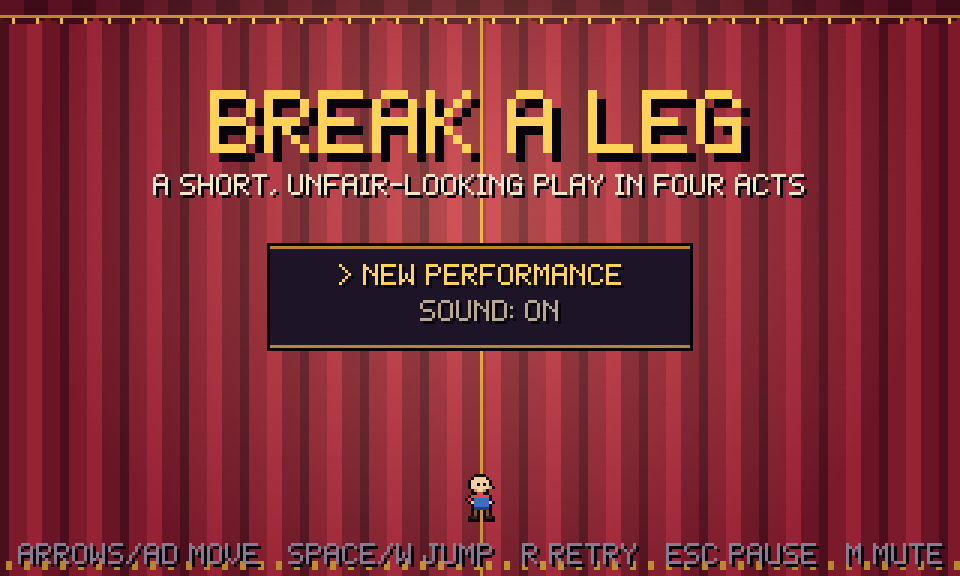
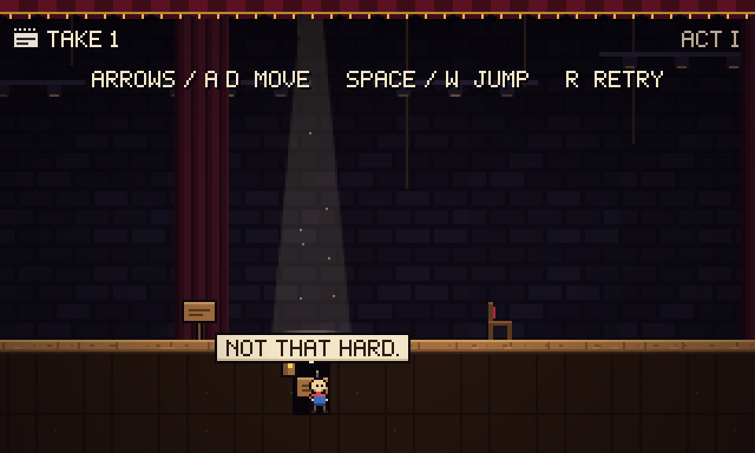
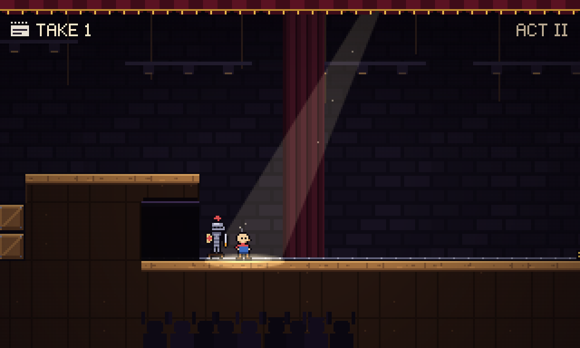
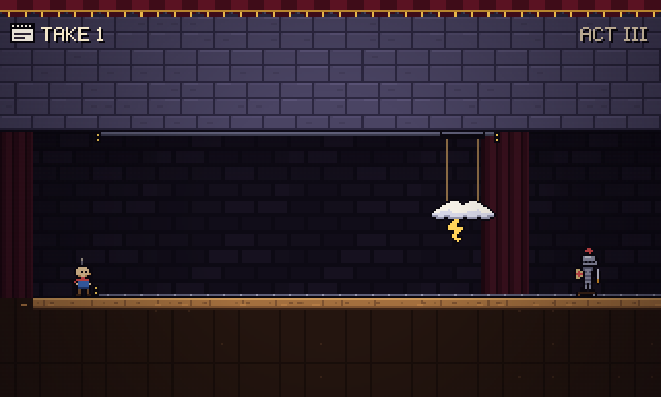
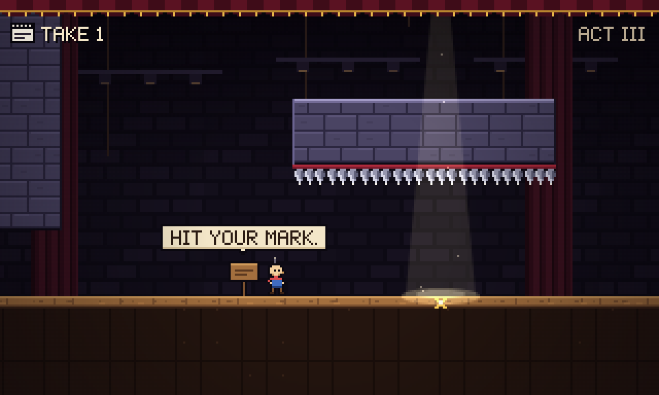
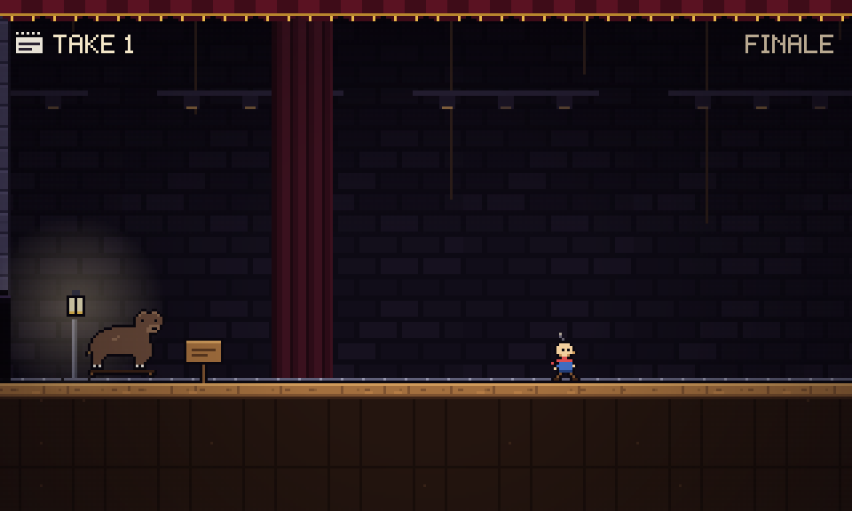
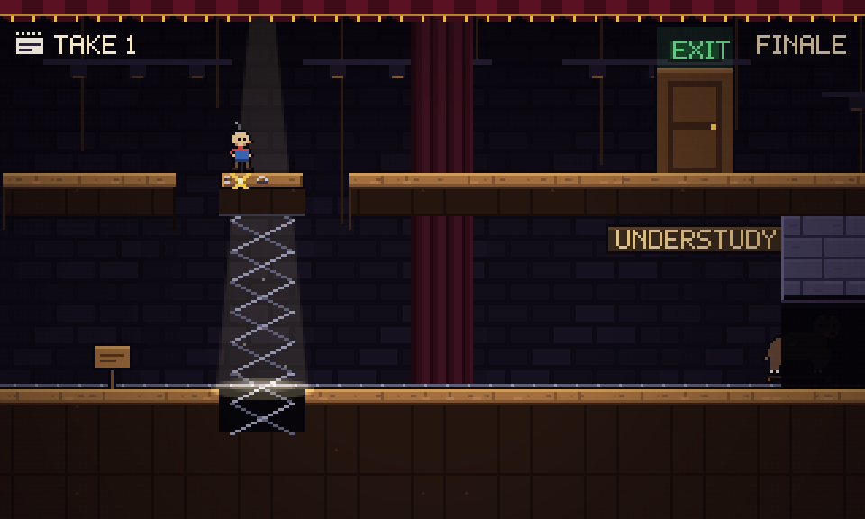
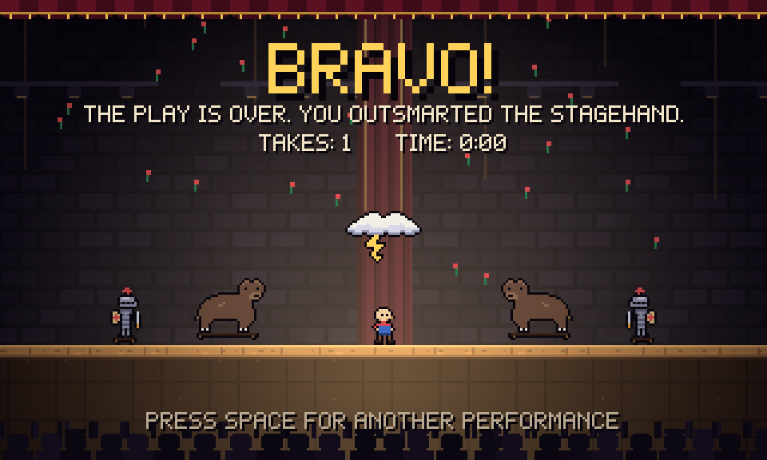

# BREAK A LEG

극장 무대 뒤에서 벌어지는 짧은 "낚시" 픽셀 플랫포머. 줄이 끊긴 꼭두각시 **핍(Pip)** 이 네 막짜리 연극을 끝까지 버텨야 한다. 무대 담당(Stagehand)이 준비한 장치는 전부 눈에 보이지만, 플레이어가 그것을 **어떻게 읽을지**를 노린다.

- 조작: `←/→` 또는 `A/D` 이동 · `Space`/`W`/`↑` 점프(길게 누르면 높이) · `R` 즉시 재시도 · `Esc` 일시정지(인터미션) · `M` 음소거 · 게임패드 지원
- 사망 → 다시 조작까지 약 0.6초. 사망 수는 화면 왼쪽 위 `TAKE n`(촬영 테이크)으로 표시

**바로 플레이: https://legerdo.github.io/break-a-leg/**

이 게임은 AI 코딩 에이전트에게 준 레벨 디자인 벤치마크 요청으로 만들어졌다. 원본 요청문: [docs/PROMPT.md](docs/PROMPT.md)



## 스크린샷

| | |
|---|---|
|  |  |
| **ACT I · HIT YOUR MARK** — 스포트라이트가 비춘 X는 트랩도어. 첫 배신은 무해하다 | **ACT II · CENTER STAGE** — 탐조등을 피해 어둠 속에서 기다리면, 등 뒤 아치에서 기사가 나온다 |
|  |  |
| **ACT III · DOUBLE ACT** — 천장 레일의 번개구름이 기사를 따라다닌다. 뛰어넘는 습관이 함정 | **ACT III · PAINTER'S TAPE** — 1막과 같은 X, 하지만 이음매가 없다. 뛰어넘으면 천장 압정 |
|  |  |
| **FINALE · EXIT, PURSUED BY A BEAR** — 한 레일로 쫓아오는 곰, 망설임이 곧 실수 | **FINALE · THE FINAL MARK** — 끝까지 트랩도어였던 "이음매 + X"가 이번엔 무대 리프트 |



## 실행

**Windows에서 가장 간단한 방법:** `play.bat`을 더블클릭. Node.js만 설치되어 있으면 된다. 첫 실행 때 의존성을 설치하고 빌드한 뒤 브라우저에서 `http://localhost:4173`을 연다. 창을 닫으면 게임 서버도 종료된다.

직접 실행:

```bash
npm install
npm run dev        # http://localhost:5173
npm run build      # 타입 검사 + dist/ 생성 (정적 파일, 아무 웹 서버에서나 실행)
npm run preview    # 빌드 결과 확인
```

TypeScript + Vite + Canvas 2D, 외부 에셋 없음(픽셀 아트·효과음·음악 전부 코드 생성). 320×192 내부 해상도를 정수배로 확대, `imageSmoothingEnabled = false`. 물리는 60Hz 고정 스텝, 렌더링과 분리.

## 검증

| 명령 | 내용 |
|---|---|
| `npm run sim` | 헤드리스 플레이테스트 40개. 각 막을 사망 0으로 클리어하는 경로, 각 함정이 "순진한 행동"을 실제로 죽이는지, 4막 연속 클리어, 무작위 입력 약 3.5만 스텝 동안 벽/천장 끼임 0 |
| `npm run fullrun` | 실제 브라우저(Chrome)에서 dev 빌드가 같은 경로로 타이틀→커튼콜까지 자동 플레이 (dev 서버를 `npx vite --port 5199`로 먼저 실행) |
| `npm run smoke` | 프로덕션 빌드(`npx vite preview --port 5200`)를 실제 키 입력만으로 조작: 이동, 사망→재조작 시간, R, Esc |
| `npm run shots` / `npm run moments` | 주요 장면 스크린샷 (`shots/`) |
| `npm run probe` | 점프 높이/거리 측정 |

마지막 확인 결과: `sim` 40/40 통과, `fullrun` PASS(사망 0, 프레임 단위 최적 플레이 기준 게임 내 1:59), `smoke` PASS(사망→재조작 640ms).

GitHub Pages 배포: `npm run build` 후 `dist/` 내용을 `gh-pages` 브랜치에 올린다(저장소 설정의 Pages 소스가 `gh-pages` / root).

dev 전용 URL 파라미터: `?act=3&cp=1&skipcard`(3막 두 번째 고스트 라이트부터), `?end`(커튼콜), `?autoplay`.

## 구조

```
src/game/world.ts     DOM 없는 시뮬레이션 (플레이어, 트랩도어, 리프트, 모래주머니, 이동 발판, 컷아웃, 트리거, 카메라)
src/game/level.ts     ASCII 세그먼트 → 레벨 빌드
src/levels/*.ts       수제 레벨 데이터 (막마다 세그먼트 배열, 함정 설계 의도 주석 포함)
src/render/*          스프라이트/타일/폰트/렌더러
src/engine/*          입력, WebAudio 신스
src/game/game.ts      타이틀·막 카드·일시정지·커튼콜
tests/                봇, 경로, 헤드리스/브라우저 테스트
```

레벨 범례: `.` 공기 `#` 무대 바닥 `W` 벽 `C` 상자 `=` 캣워크(아래에서 통과) `^ v` 압정 `T` 트랩도어 판 `X` 테이프 붙은 트랩도어 `x` 테이프 붙은 **평범한** 바닥 `L/M` 무대 리프트(M은 테이프). 트리거·모래주머니·레일 등은 세그먼트의 `ents` 목록.

---

## 레벨 디자인

### 공정성 원칙

**죽일 수 있는 것은 전부 눈에 보인다.** 압정, 줄에 매달린 모래주머니, 판 가장자리의 이음매·경첩·손잡이(트랩도어), 바닥의 레일과 범퍼(컷아웃이 갈 수 있는 범위), 레일이 들어가는 어두운 아치(무언가 숨어 있는 곳). 랜덤 요소 없음. 모든 함정은 같은 규칙으로 매번 똑같이 동작한다. 트랩도어 아래 구멍은 가려져 있지만, 판 자체의 이음매가 항상 신호다.

낚시는 정보를 숨기지 않고 **오해하게** 만든다. 표지판·X 테이프·스포트라이트는 무대 담당의 "지시"이고, 게임은 그 지시에 대한 플레이어의 해석을 이용한다.

### 기믹 문법 (소개 → 확인 → 변형 → 역이용)

| 문법 | 소개 | 확인 | 변형 | 역이용 |
|---|---|---|---|---|
| 이음매 판(트랩도어/리프트) | T1 X 아래 무해한 구덩이 | T4 X는 2칸 판의 절반일 뿐 | II-seams 테이프 없는 이음매 · T9 모래주머니로 열기 | T13 체크포인트 아래가 길 · T16 이음매 없는 X · FINAL MARK X가 리프트 |
| 모래주머니 | T2 구덩이 속 발판 | T3 달려오면 깔림 | T5 문 위 · T9 탐침 · T14b 두 종류 | T12 조심하면 봉쇄 · T15 기사를 잡는 무기 · 피날레 곰 지연 |
| 레일 위 컷아웃 | T6 순찰 기사 | T7 날개에서 등장 | T8 등 뒤에서 · T14 천장 구름과 동기화 | T15 주머니로 제압 · 피날레 곰(레일 끝이 곧 곰의 한계) |
| 스포트라이트·X·표지판 | T1 미끼 | T4 미끼 | T8 무해함 · II-seams 처음으로 정직 | T16 아무것도 없는 미끼 · FINAL MARK 진실 |
| 고스트 라이트 | 항상 안전 | — | — | T13 저장은 되고, 바닥이 열린다 |

### 함정 목록

레벨 파일 주석은 같은 이름과 설계 초안 번호(T1~T16)를 쓴다.

| # | 이름 | 플레이어의 예상 (왜) | 게임이 하는 일 | 두 번째 시도 |
|---|---|---|---|---|
| 1 | HIT YOUR MARK | 스포트라이트+표지판이 가리키는 곳은 서도 되는 곳 (첫 표지판들이 정직했음) | X가 트랩도어. 얕은 구덩이에 "NOT THAT HARD." | 뛰어넘기. 이음매를 처음 본다 |
| 2 | SANDBAG BRIDGE | 5칸 압정 구덩이는 못 건넌다 | 다가가면 주머니가 구덩이에 떨어져 압정을 덮고 발판이 됨 | — (규칙 소개: 주머니는 떨어지고, 떨어지면 단단하다) |
| 3 | HEADROOM | 주머니는 내 앞에 떨어져 도와준다 (2) | 통로 위 주머니가 내가 밑에 올 때 떨어진다. 달리면 깔림 | 살금살금 다가가면 앞에 떨어져 허들이 됨 |
| 4 | THE BIGGER PICTURE | X만 피하면 된다 (1) | X는 2칸 판의 첫 칸. X 바로 뒤에 착지하면 두 번째 판이 열림 | 이음매 끝까지 긴 점프. "테이프가 아니라 이음매를 읽어라" |
| 5 | STAGE DOOR | 문 위 주머니가 나를 깔 것이다 (3) | 담력 시험. 달려 들어가면 문이 이기고, 살금살금이면 허들, 밑에서 멈추면 깔림 | 어느 쪽이든 결단 |
| 6 | KNIGHT PATROL | — | 정직한 순찰. 레일이 경로를 정확히 보여준다 | 신뢰 구축 |
| 7 | FROM THE WINGS | 기사 없는 레일은 장식 (6에선 기사가 항상 보였음) | 어두운 터널 속 기사가 다가가면 굴러나온다 | 트리거 뒤에서 기다렸다 넘기 |
| 8 | CENTER STAGE | 훑는 탐조등은 걸리면 안 된다 (1·4의 스포트라이트=함정, 잠입 게임 관습) | 빛은 무해(따라다니는 팔로우 스포트가 됨). 어둠 속에서 기다리면 방금 밟고 온 턱 밑 아치에서 기사가 나온다 | 빛을 무시하고 걸어가기 |
| 9 | II-seams | 스포트라이트 = 함정 | 테이프 없는 이음매 셋, 그 사이 유일한 안전 착지점을 스포트라이트가 비춘다 | 이음매만 읽으면 끝 ("이제 이 게임 알겠다") |
| 10 | THE PROBE | 5칸 이음매는 절대 못 건넌다 | 2+4의 결합: 가장자리에 서면 주머니가 판을 열고 구덩이 바닥 발판이 됨 | 자신감 보상 |
| 11 | LOW CLEARANCE | 주머니엔 살금살금 (3, "MIND YOUR HEAD.") | 1칸 터널 위 긴 수직 갱도의 주머니. 조심하면 앞에 떨어져 터널을 막는다 (`BOXED IN? PRESS R`) | 갱도가 높다 = 주머니가 느리다 → 전력질주 |
| 12 | GHOST LIGHT | 고스트 라이트는 안전, 이음매는 죽음 — 충돌 | 막다른 길의 라이트가 이음매 위에. 저장이 되고 0.45초 뒤 바닥이 열려 숨은 통로로 안전하게 떨어진다 | 이음매가 "길"일 수도 있다는 첫 암시 |
| 13 | DOUBLE ACT | 기사는 뛰어넘는 것 (6·7) | 천장 레일의 번개구름이 기사 위를 따라다닌다. 점프하면 번개 | 천장 레일이 더 짧다 → 구름이 못 가는 곳까지 따라가서 넘기 |
| 14 | MIXED SIGNALS | 11을 배웠으니 주머니엔 질주 | 같은 표지판 아래 주머니 둘: 머리 위가 트인 낮은 주머니(질주하면 깔림)와 좁은 터널 위 갱도 주머니(조심하면 봉쇄) | 규칙을 외우지 말고 지형(낙하 거리·통로 높이)을 읽기 |
| 15 | BAG THE KNIGHT | 주머니는 나를 노린다 | 점프로 못 넘는 낮은 복도의 기사. 반환점 위의 주머니를 기사에게 떨어뜨려야 한다 | 3에서 배운 낙하 지연(≈0.4초)으로 타이밍 |
| 16 | PAINTER'S TAPE | 1막과 같은 스포트라이트+"HIT YOUR MARK."+X = 트랩도어 (1·4) | 이번엔 이음매 없는 평범한 바닥. 뛰어넘으면 천장 압정 | 그냥 걸어가기. 4의 교훈("이음매를 읽어라")이 정답 |
| 17 | EXIT, PURSUED BY A BEAR | — | 곰이 한 레일로 추격(달리기보다 느림). 새 규칙 없이 4·7·11·16과 레일 끝을 망설임 없이 처리해야 함. 주머니가 레일에 떨어지면 곰이 잠깐 막힌다 | 망설임이 실수 |
| 18 | THE FINAL MARK | X+이음매+"HIT YOUR MARK."는 지금까지 전부 트랩도어 | 무대 리프트. 발코니의 틈이 정확히 X 위에 있다. 대역 곰(UNDERSTUDY)이 압박 | 첫 함정의 표지판을 이번엔 믿기 |

### 사고 난이도 곡선

- **1막 (보이는 것에 반응)**: 규칙 하나씩 배신. 모든 죽음은 원인이 바로 옆에 보인다.
- **2막 (패턴 기억)**: 아치=숨은 기사, 빛=그냥 빛, 주머니+이음매 결합. 끝부분은 자신감을 주는 구간.
- **3막 (게임이 내 습관을 안다)**: 조심(11), 이음매 공포(12), 점프 습관(13), 방금 배운 교훈의 과적용(14), 테이프 공포(16)가 각각 함정이 된다.
- **피날레**: 새 기믹 없이 재조합 + 압박. 마지막 질문은 "첫 번째 거짓말을 이번엔 믿을 것인가".

### 체크포인트

하나의 학습 단위가 끝날 때마다: 1막 3개, 2막 3개, 3막 4개(12번은 함정 겸용), 피날레 2개. 죽었을 때 이미 푼 구간 반복은 대체로 10초 이내.

### 자체 평가: 기대를 조작하는가, 장난 모음인가?

모든 치명적 함정은 (a) 눈에 보이는 무대 요소로 예고되고, (b) 직전에 배운 규칙에서 나온 예상을 노리며, (c) 헤드리스 테스트로 "순진한 행동은 죽고, 알고 하는 행동은 산다"가 검증되어 있다. 무작위, 화면 밖 즉사체, 보이지 않는 벽은 없다. 약점도 있다:

- 5번(STAGE DOOR)은 기대를 뒤집기보다 담력 시험에 가깝다. 긴장·이완 박자로 남겨 두었다.
- 7번과 8번은 첫 조우 때 반응 시간이 짧다(약 0.3초). 레일과 아치가 정보를 주지만, 처음엔 대부분 한 번 죽는다. 원인이 바로 보이고 재도전이 즉시라 의도한 범위 안이라고 판단했다.
- 15번 타이밍 실패와 11·14번 봉쇄는 죽음 대신 막힌 상태가 되므로 `R` 안내를 띄운다.
- 18번 리프트는 발코니 틈과 추론에 기대므로, 곰에게 몇 번 잡힐 수 있다(바로 앞 고스트 라이트에서 재시작).

플레이 시간: 프레임 단위 최적 경로는 약 2분(막 전환 포함 약 2분 10초). 대기와 망설임이 있는 숙련자는 대략 3~4분, 첫 플레이는 10~20분으로 **추정**한다. 사람 대상 플레이테스트는 하지 않았으므로 이 수치는 검증된 값이 아니다.
